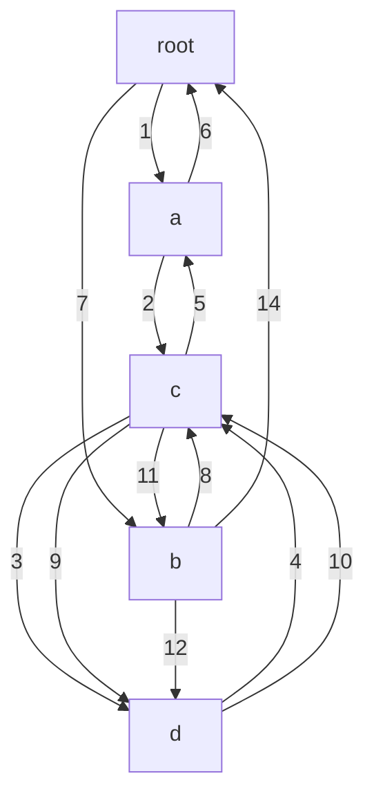

В этом разделе хочется разобрать функции не с точки зрения
языка Go, а скорее в общем виде - "как это устроено?"

Функция - это выполняемый в порядке перечисления код. 
Так например, код ниже **всегда** будет печатать числа от 
1 до 4 в порядке возрастания

```go
package funcs

func printer() {
	println(1)
	println(2)
	println(3)
	println(4)
}
```

Немного усложним пример:

```go
package funcs


func root() {
    println("root")
	a()
	b()
}

func a() {
	println("a")
	c()
}

func b() {
	println("b")
	c()
	d()
}

func c()  {
	println("c")
	d()
}

func d()  {
	println("end")
}

```

Процесс последовательного исполнения будет выглядеть вот так.

Один пункт (найдёшь какой?) пропущен для более красивой картинки. 


Каждый блок - это функция (читать, набор кода). 
Функции, помимо выполнения полезных действий могут вызывать
друг друга. 

На самом деле тот же вызов _println_ является вызовом функции.
Если в IDE перейти "внутрь" функции println мы увидим

```go
// ...
package builtin

// ...

// The println built-in function formats its arguments in an
// implementation-specific way and writes the result to standard error.
// Spaces are always added between arguments and a newline is appended.
// Println is useful for bootstrapping and debugging; it is not guaranteed
// to stay in the language.
func println(args ...Type)

```

Стоит заметить, что у этой функции описана только 
сигнатура (название и аргументы), но не описано
содержание. Дело в том, что выполнение функционала
"написания чего либо в стандартный вывод - STDOUT" 
отличается от платформы к платформе и эта унификация 
будет изменена на нужное поведение в момент компиляции 